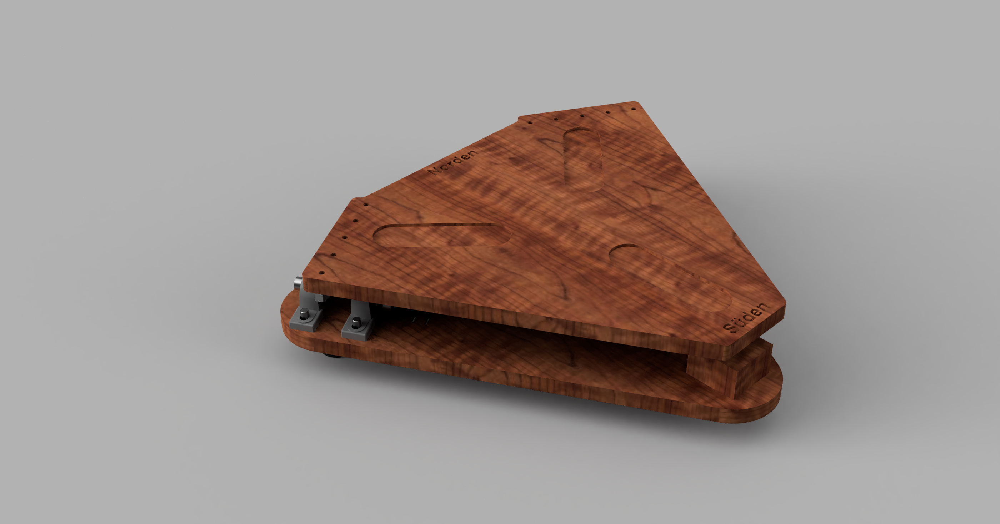
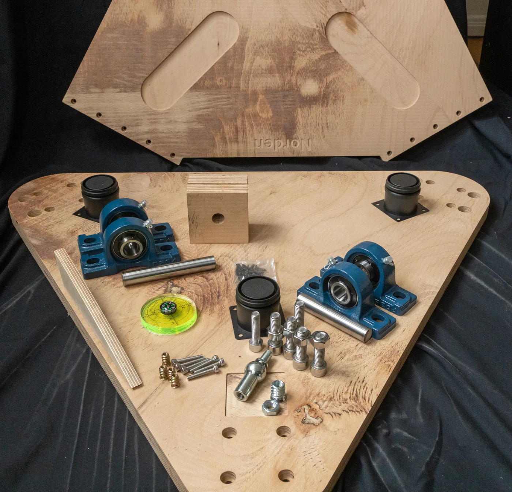
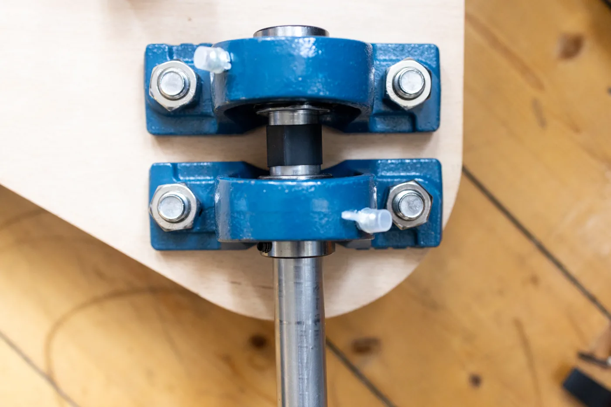
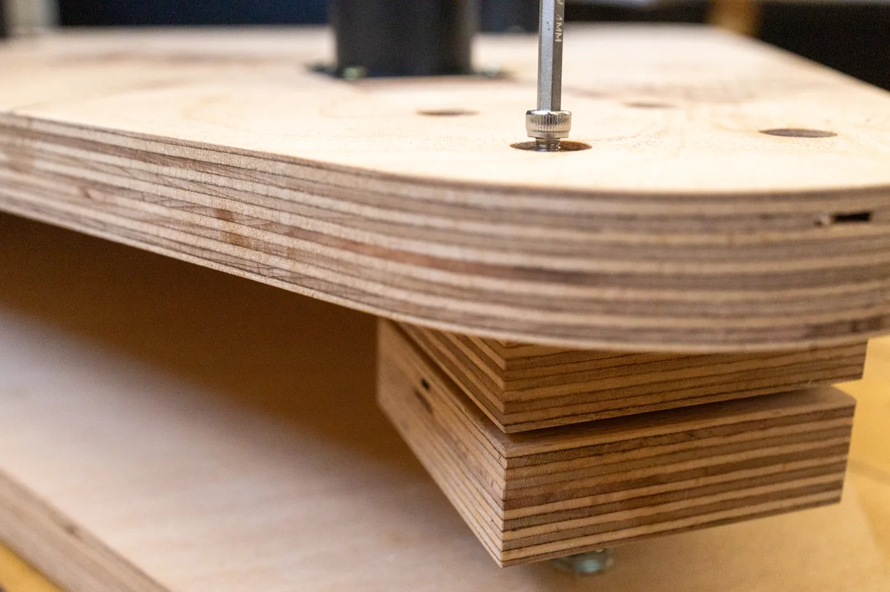
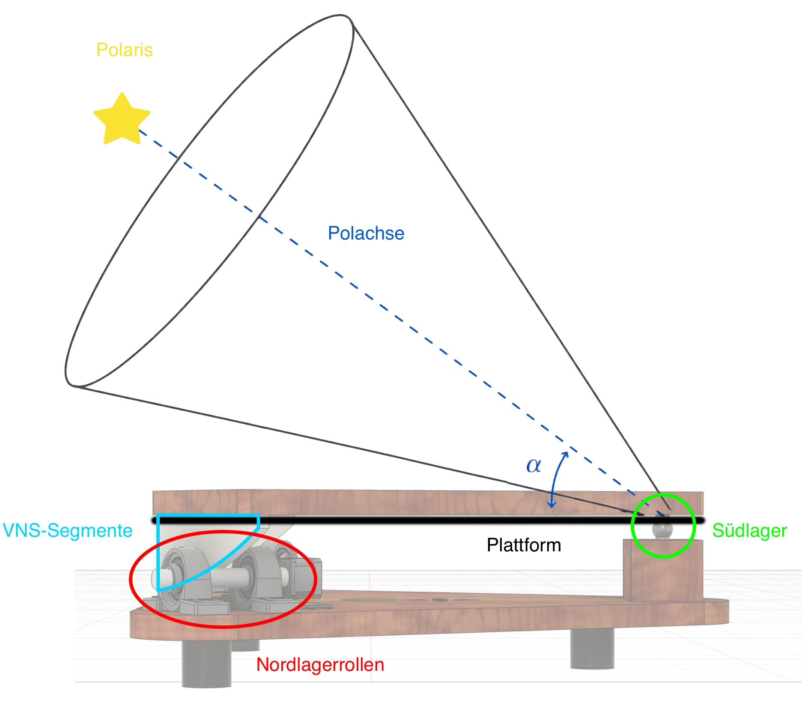
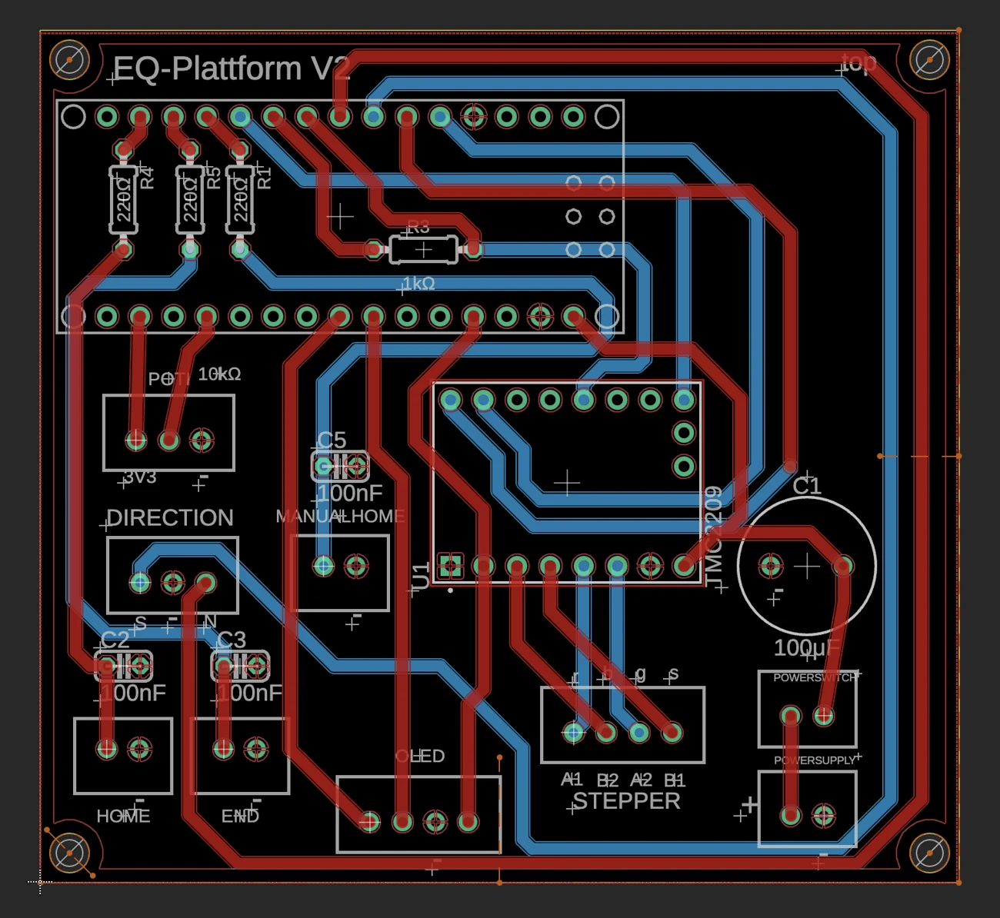
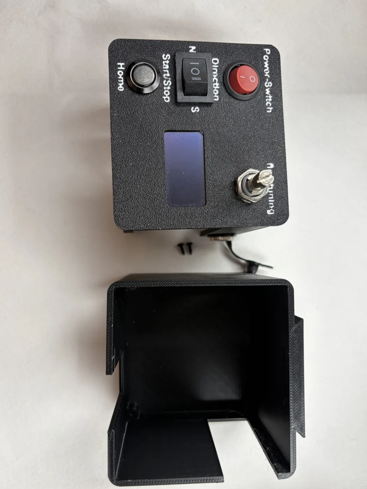

  

    <nav class="eq-nav" aria-label="Hauptnavigation">
      <a class="eq-brand" href="./">
        EQ
        EQ Plattform
      </a>
      

        <a href="#prinzip">Prinzip</a>
        <a href="#projektion">Projektion</a>
        <a href="#aufbau">Aufbau</a>
        <a href="#antrieb">Antrieb</a>
        <a href="#downloads">Downloads</a>
      

    </nav>

    <main>
      <header class="eq-hero">
        

          
DIY-Nachführung für Dobson-Teleskope

          <h1>Mehr Zeit am Objekt.</h1>
          

            Eine kompakte äquatoriale Plattform, die die Erdrotation ausgleicht und
            Himmelsobjekte länger im Gesichtsfeld hält. Mechanik, Elektronik und
            Firmware sind vollständig dokumentiert.
          

          

            <a class="eq-button" href="flasher/">Firmware installieren</a>
            <a class="eq-button secondary" href="build_instructions/buildinstruction_EQ_Plattform.pdf">Bauanleitung öffnen</a>
            <a class="eq-button secondary" href="#downloads">Dateien herunterladen</a>
          

          

            18 Seiten Anleitung
            Firmware für Uno &amp; Nano
            NEMA17 + TMC2209
          

        

        <figure class="eq-hero-media">
          
          <figcaption>Fertige EQ Plattform mit motorisierter Nachführung</figcaption>
        </figure>
      </header>

      <section class="eq-intro" aria-labelledby="worum-es-geht">
        <h2 id="worum-es-geht">Worum es geht</h2>
        

          Das Projekt verfolgt die Idee einer Do-it-yourself-EQ-Plattform, die sich
          vergleichsweise preisgünstig herstellen lässt, ohne dass man zwangsläufig
          handwerkliche Fähigkeiten benötigt. Es ähnelt eher einem Bausatz eines gewissen Möbelhauses –
          daher nennen wir es spaßeshalber Stjärnföljare: Die Teile werden online
          bestellt, und der Benutzer baut die Plattform nach Anleitung zusammen.
          Die Kosten fallen dabei deutlich niedriger aus als bei kommerziell
          erhältlichen Plattformen. Im Folgenden werden die nötigen Teilelisten und
          Bauschritte im Einzelnen erklärt.
        

      </section>

      <section class="eq-section soft" id="aufbau">
        

          <h2>Mechanik in sechs Schritten</h2>
          

            Die Website zeigt den Ablauf. Maße, Bohrbilder und Detailfotos stehen
            in der PDF-Bauanleitung.
          

        

        

          <article class="eq-step">
            01
            <h3>Möbelfüße montieren</h3>
            
Füße in den vorgesehenen Ausfräsungen der Grundplatte verschrauben.

          </article>
          <article class="eq-step">
            02
            <h3>Stehlager vormontieren</h3>
            
Vier UCP204-Lager zunächst nur handfest auf der Grundplatte befestigen.

          </article>
          <article class="eq-step">
            03
            <h3>Linearwellen einsetzen</h3>
            
Wellen ausrichten, in die Lager schieben und mit Madenschrauben fixieren.

          </article>
          <article class="eq-step">
            04
            <h3>Tischplatte vorbereiten</h3>
            
M10-Gewindeeinsatz setzen und das Kugelgelenk einschrauben.

          </article>
          <article class="eq-step">
            05
            <h3>Kreissegmente montieren</h3>
            
M5-Gewindeeinsätze setzen und beide Segmente an der Tischplatte verschrauben.

          </article>
          <article class="eq-step">
            06
            <h3>Südlager befestigen</h3>
            
Holzblock mit M8-Gewindeeinsätzen montieren und die Leichtgängigkeit prüfen.

          </article>
        

        

          <figure class="eq-photo-card">
            
            <figcaption>Mechanische Bauteile vor dem Zusammenbau</figcaption>
          </figure>
          <figure class="eq-photo-card">
            
            <figcaption>Nordlager mit UCP204-Stehlagern und Linearwellen</figcaption>
          </figure>
          <figure class="eq-photo-card">
            
            <figcaption>Holzblock und Kugelgelenk bilden das Südlager</figcaption>
          </figure>
        

      </section>

      <section class="eq-section soft" id="prinzip">
        

          

            
Funktionsprinzip

            <h2>Parallel zur Erdachse</h2>
            

              Die bewegliche Tischplatte dreht sich um eine Achse, die parallel zur
              Erdachse ausgerichtet wird. Dadurch kompensiert die Plattform die
              scheinbare Bewegung des Sternenhimmels.
            

            <ul class="eq-checks">
              <li>Nordlager über zwei Kreissegmente auf Linearwellen</li>
              <li>Südlager als definierter Dreh- und Neigungspunkt</li>
              <li>Feine Geschwindigkeitsregelung über Schrittmotor und Potentiometer</li>
            </ul>
          

          <figure class="eq-diagram">
            
            <figcaption>Prinzipdarstellung aus der Bauanleitung</figcaption>
          </figure>
        

      </section>

      <section class="eq-section" id="projektion" aria-labelledby="projektion-title">
        

          <h2 id="projektion-title">Vom Kreis zum Rollensegment</h2>
          

            Zwei Projektionen bestimmen die Form: Der Breitengrad skaliert das
            VNS-Segment vertikal, der Rollenwinkel korrigiert die horizontale Länge.
          

        

        

          

            

              Die Animation zeigt zuerst die Projektion des Kreises zur Ellipse und
              anschließend die Korrektur für die um 30° verstellten Rollen.
            

            <button class="eq-button eq-projection-play" id="eq-projection-play" type="button">
              Animation abspielen
            </button>
          

          

            <article class="eq-projection-panel" aria-labelledby="eq-projection-step-one">
              

                <h3 id="eq-projection-step-one">1 · Kreis → Ellipse</h3>
                φ = 50° · cos(φ) = 0,643
              

              <svg class="eq-projection-svg" id="eq-projection-left" role="img" aria-label="Projektion eines Kreises auf eine Ellipse; die rote VNS-Segmentfläche liegt unten rechts und wird mit Kosinus Phi skaliert"></svg>
            </article>

            <article class="eq-projection-panel" aria-labelledby="eq-projection-step-two">
              

                <h3 id="eq-projection-step-two">2 · Rollenwinkel β</h3>
                30° · Faktor 1,155
              

              <svg class="eq-projection-svg" id="eq-projection-right" role="img" aria-label="Darstellung der Rollenverstellung; Ellipse und rote VNS-Segmentfläche werden um Beta gedreht und horizontal mit dem Kehrwert von Kosinus Beta gestreckt"></svg>
            </article>
          

          

            

              

                <label for="eq-projection-phi">Breitengrad φ</label>
                <output id="eq-projection-phi-output" for="eq-projection-phi">50°</output>
              

              <input id="eq-projection-phi" type="range" min="0" max="70" step="1" value="50" />
            

            

              

                <label for="eq-projection-beta">Rollenwinkel β</label>
                <output id="eq-projection-beta-output" for="eq-projection-beta">30°</output>
              

              <input id="eq-projection-beta" type="range" min="0" max="45" step="1" value="30" />
            

          

          

        

      </section>

      <section class="eq-section">
        

          <h2>Bauteile auf einen Blick</h2>
          

            Die vollständige Stückliste enthält alle Schrauben und Bezugsquellen.
            Für das Grundprinzip reichen drei Baugruppen.
          

        

        

          <article class="eq-card">
            Mechanik
            <h3>Platten und Lagerung</h3>
            <ul>
              <li>Grund- und Tischplatte</li>
              <li>Zwei Kreissegmente</li>
              <li>2 Linearwellen Ø20 × 100 mm</li>
              <li>4 UCP204-Stehlager</li>
              <li>Kugelgelenk M10</li>
            </ul>
          </article>
          <article class="eq-card">
            Antrieb
            <h3>Riemen und Motor</h3>
            <ul>
              <li>NEMA17-Schrittmotor</li>
              <li>Winkelhalter</li>
              <li>GT2-Riemen und Pulleys</li>
              <li>Zwei Endstops</li>
              <li>Motorisierte Referenzfahrt</li>
            </ul>
          </article>
          <article class="eq-card">
            Steuerung
            <h3>PCB und Bedienung</h3>
            <ul>
              <li>Arduino Nano V3</li>
              <li>TMC2209-Treiber</li>
              <li>1,3-Zoll-OLED</li>
              <li>Schalter und Home-Taster</li>
              <li>10-kΩ-Potentiometer</li>
            </ul>
          </article>
        

      </section>

      <section class="eq-section dark" id="antrieb">
        

          <h2>Präziser Antrieb, einfache Bedienung</h2>
          

            Die eigene Steuerplatine verbindet Arduino, TMC2209, Display,
            Bedienelemente und Endstops zu einer kompakten Einheit.
          

        

        

          <article class="eq-dark-card">
            
            

              <h3>Steuerplatine</h3>
              

                Alle Anschlüsse sind zentral geführt. Die Fertigungsdaten können
                direkt als ZIP heruntergeladen und bei einem Leiterplattenservice
                bestellt werden.
              

            

          </article>
          <article class="eq-dark-card">
            
            

              <h3>Gehäuse und Bedienung</h3>
              

                Das 3D-gedruckte Gehäuse nimmt Platine, OLED, Schalter, Taster,
                Potentiometer und Stromanschluss auf und wird an der Plattform
                befestigt.
              

            

          </article>
        

        

          Beim Bestücken auf die Polarität des Elektrolytkondensators achten,
          offene Lötstellen isolieren und vor der Inbetriebnahme alle Verbindungen prüfen.
        

      </section>

      <section class="eq-section">
        

          <h2>Standard oder Simple</h2>
          

            Beide Mechanikvarianten verwenden dasselbe Funktionsprinzip und
            dieselbe Elektronik.
          

        

        

          <article class="eq-card">
            Standard
            <h3>Vollständige Ausführung</h3>
            

              Mit Aussparungen für Libelle, Kompass und Windrose sowie
              Markierungen auf der Oberplatte.
            

          </article>
          <article class="eq-card">
            Simple
            <h3>Reduzierte Fertigung</h3>
            

              Weniger Aussparungen und Markierungen senken den Fräsaufwand,
              ohne das Grundprinzip zu verändern.
            

          </article>
          <article class="eq-card">
            Alternative
            <h3>Aluminiumsegmente</h3>
            

              Kreissegmente für Winkel von 40 bis 60 Grad stehen zusätzlich
              als STEP-Dateien für Aluminium bereit.
            

          </article>
        

      </section>

      <section class="eq-section soft" id="downloads">
        

          <h2>Alles zum Nachbauen</h2>
          

            Anleitung lesen, Teile fertigen lassen und die fertige Firmware
            direkt im Browser installieren.
          

        

        

          <a class="eq-resource" href="build_instructions/buildinstruction_EQ_Plattform.pdf">
            PDF · 32 Seiten
            
              <strong>Bauanleitung</strong>
              <small>Prinzip, Bauteile, Montage, Elektronik und Inbetriebnahme.</small>
            
            →
          </a>
          <a class="eq-resource" href="teileliste/">
            Web · CSV
            
              <strong>Stückliste</strong>
              <small>Übersichtlich sortiert mit Mengen und kurzen Händlerlinks.</small>
            
            →
          </a>
          <a class="eq-resource" href="flasher/">
            Chrome · Edge
            
              <strong>Firmware Flasher</strong>
              <small>HEX-Datei ohne Arduino IDE direkt per USB installieren.</small>
            
            →
          </a>
          <a class="eq-resource" href="https://github.com/MoMa13570/eq-plattform/releases/latest">
            Release
            
              <strong>Aktuelle Firmware</strong>
              <small>Geprüfte HEX-Datei für Arduino Uno und Nano.</small>
            
            →
          </a>
          <a class="eq-resource" href="hardware/circuitboard/EQ-Plattform%20Schaltplan_TMC2209%20v32_jlcpcb.zip">
            ZIP
            
              <strong>PCB-Fertigungsdaten</strong>
              <small>Datenpaket für die Herstellung der Steuerplatine.</small>
            
            →
          </a>
          <a class="eq-resource" href="https://github.com/MoMa13570/eq-plattform/tree/main/hardware/mechanical">
            STEP · STL · 3MF
            
              <strong>CAD-Dateien</strong>
              <small>Mechanikvarianten, Kreissegmente und Elektronikgehäuse.</small>
            
            →
          </a>
          <a class="eq-resource" href="https://mende-cnc.de/" target="_blank" rel="noopener">
            Beispielanbieter
            
              <strong>Teile fertigen lassen</strong>
              <small>Holzteile fräsen und Gehäuseteile per 3D-Druck herstellen lassen.</small>
            
            ↗
          </a>
        

      </section>

      <section class="eq-final">
        

          <h2>Bereit für den Aufbau?</h2>
          

            Die PDF führt durch alle Details. Für die Firmware reichen anschließend
            eine HEX-Datei, Chrome oder Edge und ein USB-Kabel.
          

        

        <a class="eq-button" href="build_instructions/buildinstruction_EQ_Plattform.pdf">Bauanleitung starten</a>
      </section>
    </main>

    <footer class="eq-footer">
      EQ Plattform · Frank Sackenheim &amp; Moritz Mayer
      <a href="https://github.com/MoMa13570/eq-plattform">GitHub Repository</a>
    </footer>
  

