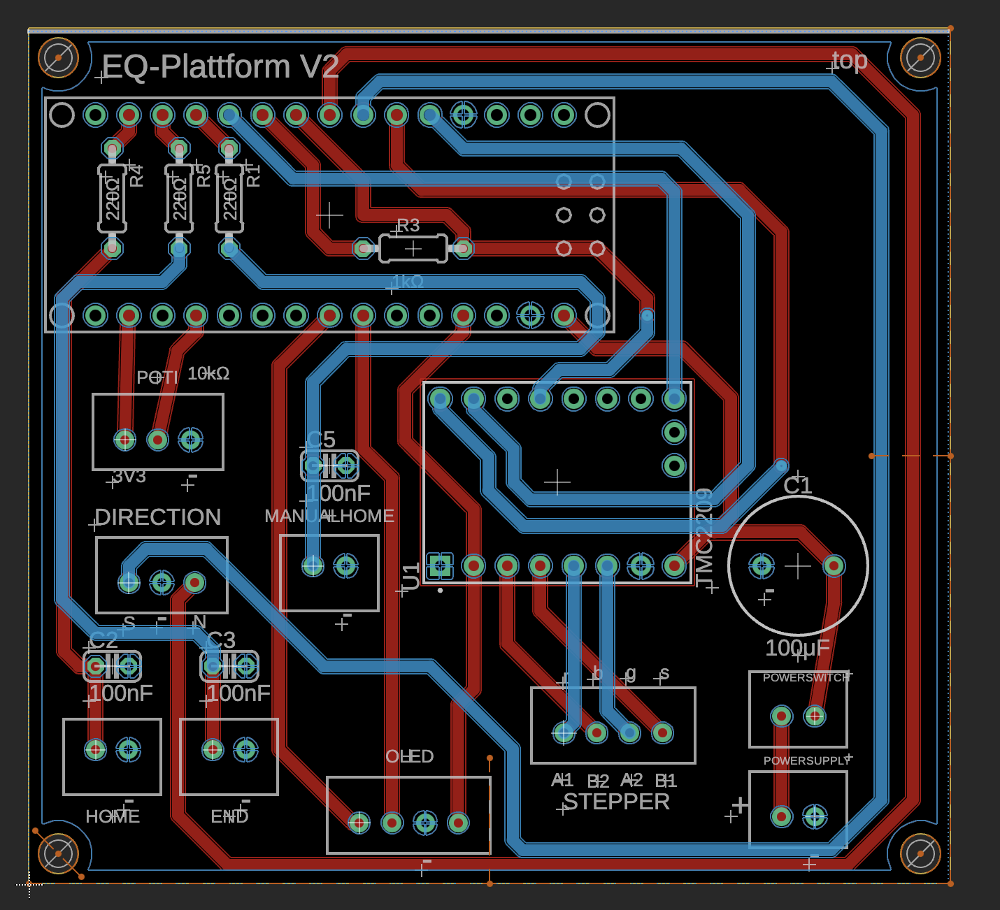
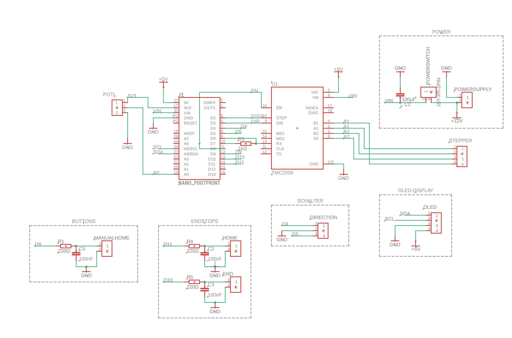

<section class="eq-hero">
  

    
DIY-Hardware für Dobson-Teleskope

    <h1>EQ Plattform</h1>
    

      Eine stabile, modulare Nachführplattform für Dobson-Teleskope. Sie kompensiert die scheinbare
      Bewegung des Sternenhimmels und hält Objekte dadurch länger im Gesichtsfeld.
    

    

      <a class="eq-button" href="flasher/">Firmware im Browser installieren</a>
      <a class="eq-button" href="build_instructions/buildinginstructions_EQ-Plattform.pdf">Bauanleitung PDF</a>
      <a class="eq-button" href="#ressourcen">Dateien ansehen</a>
      <a class="eq-button secondary" href="part%20list/Teileliste_DM%20EQ%20Plattform.csv">Stückliste ansehen</a>
      <a class="eq-button secondary" href="https://github.com/MoMa13570/eq-plattform">GitHub-Repository</a>
    

  

  

    
  

</section>

<section class="eq-section">
  <h2>Worum es geht</h2>
  

   Das Projekt verfolgt die Idee einer Do-it-yourself-EQ-Plattform, die sich vergleichsweise preisgünstig herstellen lässt, ohne dass man zwangsläufig handwerkliche Fähigkeiten benötigt. Es ähnelt eher einem Ikea-Bausatz – daher nennen wir es spaßeshalber Stjärnföljare: Die Teile werden online bestellt, und der Benutzer baut die Plattform nach Anleitung zusammen. Die Kosten fallen dabei deutlich niedriger aus als bei kommerziell erhältlichen Plattformen. Im Folgenden werden die nötigen Teilelisten und Bauschritte im Einzelnen erklärt.
  

  

    

      <h3>Mechanischer Aufbau</h3>
      
Grundplatte, Tischplatte, Linearwellen, Stehlager, Südlager und Kreissegmente bilden die Plattform.

    

    

      <h3>Präziser Schrittmotor-Antrieb</h3>
      
Die Plattform nutzt eine eigene PCB mit TMC2209-Treiber und NEMA17-Schrittmotor.

    

    

      <h3>Offen dokumentiert</h3>
      
CAD-Daten, Stückliste, Schaltplan, Leiterplatte und Firmware liegen frei im Repository.

    

  

  

    Aktuell empfohlener Aufbau: NEMA17-Schrittmotor mit Steuerplatine. Die frühere alternative Motorvariante
    hat sich nicht bewährt und wird nicht weiter empfohlen.
  

</section>

<section class="eq-section">
  <h2>Aufbau in 5 Schritten</h2>
  

    Die Website zeigt nur den Überblick. Die genauen Maße, Bohrungen, Montageschritte und Elektronikdetails
    stehen in der PDF-Bauanleitung.
  

  

    

      <h3>Grundplatte vorbereiten</h3>
      
Möbelfüße montieren und die Stehlager zunächst handfest auf der Grundplatte befestigen.

    

    

      <h3>Linearwellen einsetzen</h3>
      
Linearwellen durch die Stehlager schieben, ausrichten und anschließend mit den Madenschrauben fixieren.

    

    

      <h3>Tischplatte vorbereiten</h3>
      
Gewindeeinsatz setzen, Kugelgelenk einschrauben und die bewegliche Tischplatte für das Südlager vorbereiten.

    

    

      <h3>Kreissegmente montieren</h3>
      
Kreissegmente mit Gewindeeinsätzen an der Tischplatte verschrauben und das Südlager montieren.

    

    

      <h3>Antrieb anbauen</h3>
      
Motorhalter, GT2-Riemen, Elektronikgehäuse und Endstops montieren und anschließend die Plattform prüfen.

    

  

</section>

<section class="eq-section" id="ressourcen">
  <h2>Dateien und Ressourcen</h2>
  

    Alle wichtigen Dateien sind nach Mechanik, Elektronik, Software und Stückliste gegliedert.
    Die vereinfachten Mechanikdateien reduzieren Fertigungsaufwand und Kosten.
  

  

    

      <h3>Mechanik</h3>
      <ul>
        <li><a href="https://github.com/MoMa13570/eq-plattform/tree/main/hardware/mechanical/normal">Normale STEP-Dateien</a></li>
        <li><a href="https://github.com/MoMa13570/eq-plattform/tree/main/hardware/mechanical/simple">Vereinfachte STEP-Dateien</a></li>
        <li><a href="https://github.com/MoMa13570/eq-plattform/tree/main/hardware/mechanical/Kreissegmente%20aus%20Aluminium">Kreissegmente aus Aluminium</a></li>
      </ul>
    

    

      <h3>Elektronik</h3>
      <ul>
        <li><a href="https://github.com/MoMa13570/eq-plattform/tree/main/hardware/circuitboard">PCB, Schaltplan und Fertigungsdaten</a></li>
        <li><a href="https://github.com/MoMa13570/eq-plattform/tree/main/hardware/circuitboard/case">Gehäuse für die Elektronik</a></li>
        <li><a href="hardware/circuitboard/EQ-Plattform%20Schaltplan_TMC2209%20v32_jlcpcb.zip">JLCPCB-Daten als ZIP</a></li>
      </ul>
    

    

      <h3>Software und BOM</h3>
      <ul>
        <li><a href="flasher/">Firmware direkt im Browser installieren</a></li>
        <li><a href="https://github.com/MoMa13570/eq-plattform/releases/latest">Aktuelle HEX-Firmware herunterladen</a></li>
        <li><a href="https://github.com/MoMa13570/eq-plattform/tree/main/software">Firmware-Quellcode und PlatformIO-Projekt</a></li>
        <li><a href="part%20list/Teileliste_DM%20EQ%20Plattform.csv">Stückliste als CSV</a></li>
        <li><a href="build_instructions/buildinginstructions_EQ-Plattform.pdf">Bauanleitung als PDF</a></li>
        <li><a href="README.md">Repository-Übersicht</a></li>
      </ul>
    

  

</section>

<section class="eq-section">
  <h2>Benötigte Hauptkomponenten</h2>
  

    Die vollständige Teileliste steht in der BOM und in der Bauanleitung. Für die erste Einschätzung sind vor
    allem diese Baugruppen wichtig:
  

  

    <ul class="eq-component-list">
      <li>CNC-gefräste Grundplatte und Tischplatte</li>
      <li>Zwei Kreissegmente aus Holz oder Aluminium</li>
      <li>Linearwellen Ø20 mm und UCP204-Stehlager</li>
      <li>Kugelgelenk M10 für das Südlager</li>
      <li>Verstellbare Möbelfüße</li>
      <li>NEMA17-Schrittmotor mit Winkelhalter</li>
      <li>GT2-Riemen, 16-Zähne-Motorpulley und 66-Zähne-Wellenpulley</li>
      <li>Steuerplatine mit Arduino Nano und TMC2209</li>
      <li>OLED-Display, Taster, Schalter und Potentiometer</li>
      <li>Endstops, Kabel und JST-XH-Steckverbinder</li>
    </ul>
  

</section>

<section class="eq-section">
  <h2>Bauanleitung</h2>
  

    Die Bauanleitung führt auf 17 Seiten durch Funktionsprinzip, benötigte Bauteile, mechanischen Aufbau,
    Motorisierung, Elektronikgehäuse, Endstops und Abschlussprüfung. Sie ist als PDF verfügbar und kann direkt
    im Browser geöffnet oder heruntergeladen werden.
  

  

    

      <h3>Bauteile</h3>
      
Übersicht über CNC-gefräste Holzteile, mechanische Komponenten und Teile für den NEMA17-Antrieb.

    

    

      <h3>Zusammenbau</h3>
      
Schritte für Möbelfüße, Stehlager, Linearwellen, Tischplatte, Kreissegmente und Südlager.

    

    

      <h3>Motorisierung</h3>
      
Hinweise zu Steuerplatine, Lötarbeiten, Gehäuse, Motormontage und Endstops.

    

  

  

    <a href="build_instructions/buildinginstructions_EQ-Plattform.pdf">Bauanleitung als PDF öffnen</a>
  

</section>

<section class="eq-section">
  <h2>Varianten</h2>
  

    

      <h3>Standardmechanik</h3>
      

        Enthält die vollständige Ausführung mit Aussparungen für Libelle, Kompass und Windrose sowie
        Markierungen auf der Oberplatte.
      

    

    

      <h3>Simple-Mechanik</h3>
      

        Reduzierte Version für günstigere Fertigung. In der Unterplatte entfallen die Aussparungen,
        in der Oberplatte die Nord- und Südmarkierungen.
      

    

    

      <h3>PCB-Antrieb</h3>
      

        Für den Schrittmotor-Aufbau stehen Schaltplan, Platinenansicht, Gehäuse und Firmware bereit.
      

    

  

</section>

<section class="eq-section">
  <h2>Elektronik</h2>
  

    Die Leiterplatte steuert den Aufbau mit NEMA17-Schrittmotor und TMC2209-Treiber.
  

  

    
    
  

</section>

<section class="eq-section">
  <h2>Software installieren</h2>
  

    Für die normale Installation werden weder Arduino IDE noch Visual Studio Code benötigt.
    Die fertige HEX-Datei lässt sich direkt mit Chrome oder Edge übertragen.
  

  

    

      <h3>Direkt im Browser</h3>
      <ol>
        <li>Aktuelle HEX-Datei aus dem GitHub Release herunterladen.</li>
        <li>Board auswählen und Arduino per USB verbinden.</li>
        <li>Firmware mit dem Browser-Flasher installieren.</li>
      </ol>
      
<a href="flasher/">Browser-Flasher öffnen</a>

    

    

      <h3>Für Entwickler</h3>
      

        Der vollständige Quellcode und die PlatformIO-Konfiguration für Uno und Nano
        liegen unter <code>software/EQ-Plattform_TMC2209/</code>.
      

      
<a href="https://github.com/MoMa13570/eq-plattform/tree/main/software/EQ-Plattform_TMC2209">PlatformIO-Projekt öffnen</a>

    

  

</section>

<section class="eq-section">
  <h2>Mitmachen</h2>
  

    Beiträge zur Dokumentation, Mechanik, Elektronik, Firmware oder zu neuen Anwendungsbeispielen sind willkommen.
    Fehler, Ideen und Verbesserungen können über Issues oder Pull Requests im Repository eingebracht werden.
  

  

    Projekt-Repository: <a href="https://github.com/MoMa13570/eq-plattform">github.com/MoMa13570/eq-plattform</a>
  

</section>

